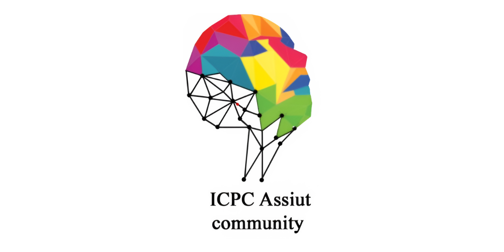
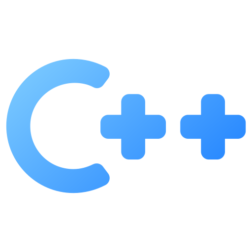

# 🏆 Assiut University Training Newcomers (C++)

  

My solutions for the famous Assiut University Training Newcomers sheets using C++. This repository serves as a record of my problem-solving journey and algorithmic thinking.

## 📊 Sheet Progress

| Sheet | Topic | Status |
| :--- | :--- | :---: |
| **Sheet #1** | Data type - Conditions | 🟢 Completed |
| **Sheet #2** | Loops | 🟢 Completed |
| **Sheet #3** | Arrays | 🟢 Completed |
| **Sheet #4** | Strings | 🟡 In Progress |
| **Sheet #5** | Functions | 🟡 Not Started |

## 🛠️ Tech Stack & Tools

  &nbsp;&nbsp;&nbsp;&nbsp;&nbsp;&nbsp;&nbsp;&nbsp;
  

## 📂 Repository Structure
- Each folder contains my clean and optimized C++ solutions for the sheet problems.
- Solutions are named after the problem code (e.g., `A_Say_Hello.cpp`).
